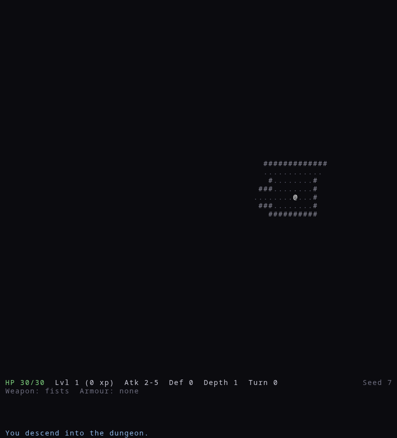
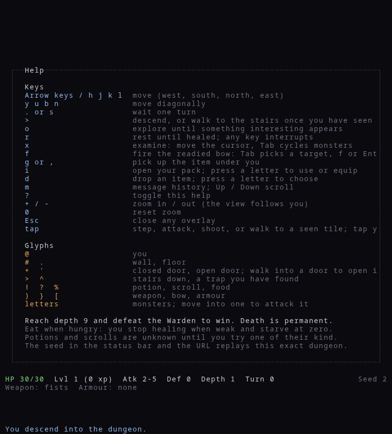
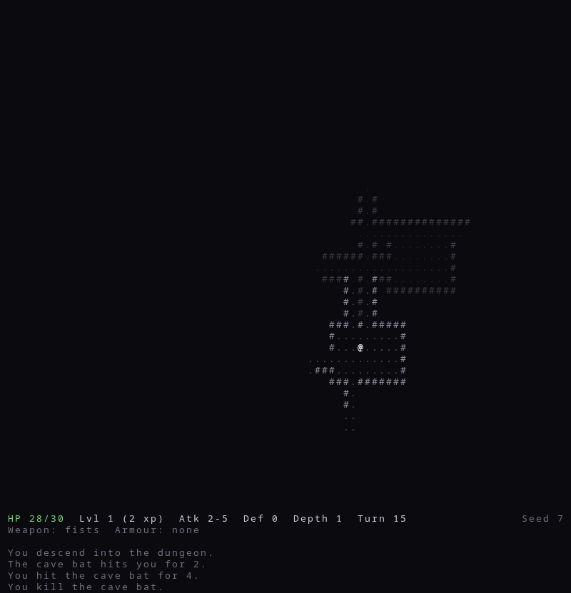
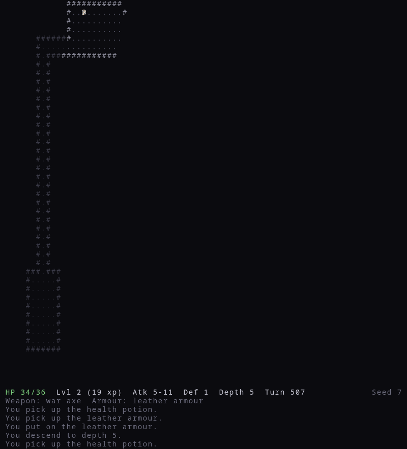
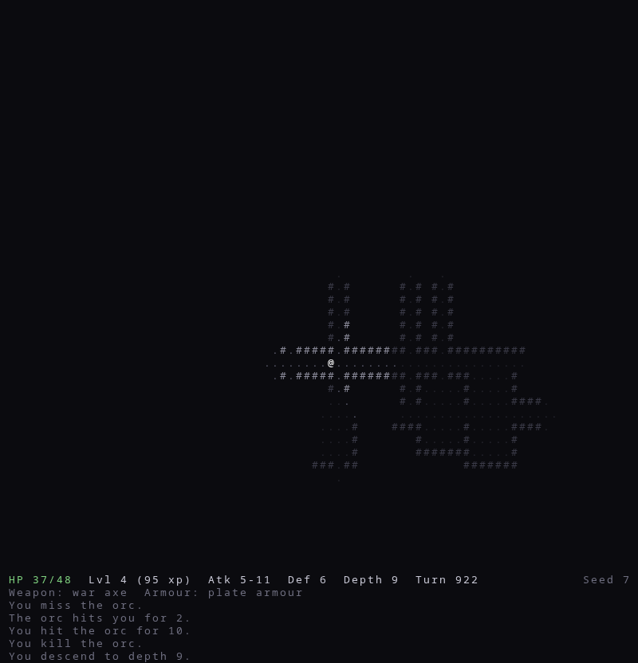
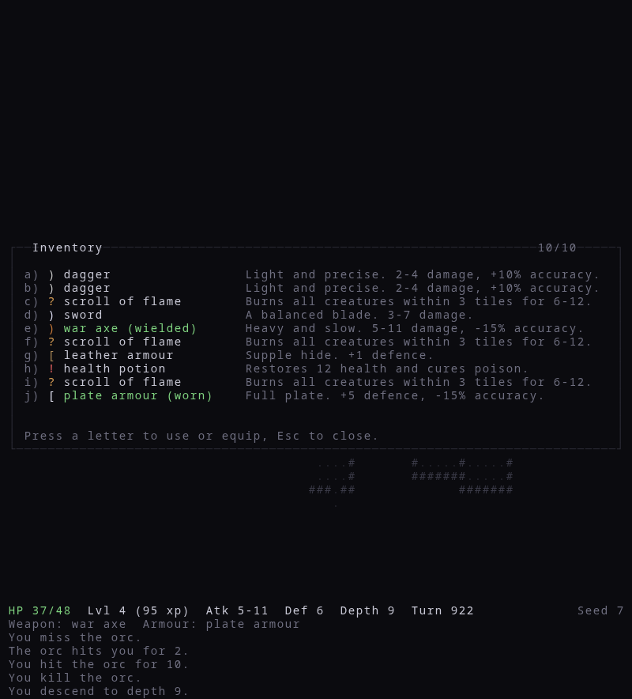
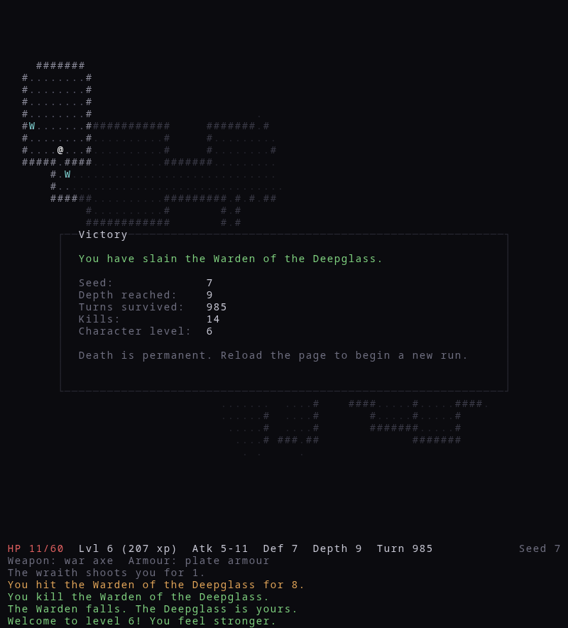
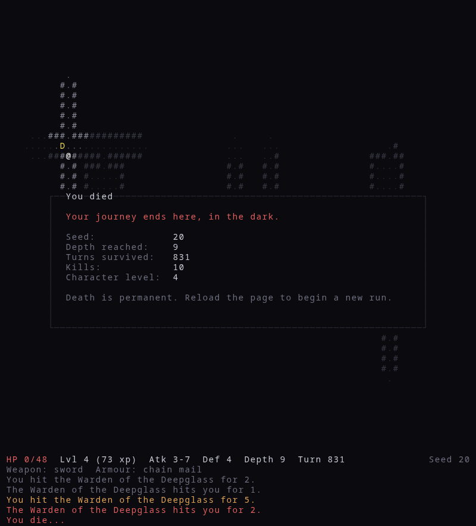

# Deepglass

[](https://github.com/Hery0019/Deepglass/actions/workflows/ci.yml)

A turn-based ASCII roguelike for the browser, playable with a keyboard or by touch. Descend eight procedurally
generated levels of rooms and caverns, reach the ninth, and kill the Warden of
the Deepglass. Death is
permanent: there is no saving and no continuing.

The game is written in TypeScript with no runtime dependencies. Rendering is
ASCII glyphs on a Canvas 2D context; the rules engine is pure, deterministic,
and runs without a browser.

## Screenshots

All captures come from real runs of the build in this repository, driven by a
scripted player through a headless browser. Seed 7 is a winning run; seed 20
dies to the Warden.

| Depth 1, turn 0 (`?seed=7`)                                                         | Help screen                                                         |
| ----------------------------------------------------------------------------------- | ------------------------------------------------------------------- |
|  |  |

| First fight                                                           | Depth 5                                                            |
| --------------------------------------------------------------------- | ------------------------------------------------------------------ |
|  |  |

| Depth 9                                                        | Inventory                                                                           |
| -------------------------------------------------------------- | ----------------------------------------------------------------------------------- |
|  |  |

| Victory (seed 7)                                                                 | Death (seed 20)                                                        |
| -------------------------------------------------------------------------------- | ---------------------------------------------------------------------- |
|  |  |

## Playing it

The latest build on `main` is deployed to GitHub Pages at
<https://hery0019.github.io/Deepglass/>. Every push to `main` that passes lint,
typecheck, tests, and build is published there by the CI workflow in
`.github/workflows/ci.yml`.

## Running it

Requirements: Node 20 or newer and npm.

```sh
npm install
npm run dev        # start the Vite dev server and open the printed URL
```

Other scripts:

```sh
npm run build      # typecheck and produce a production build in dist/
npm run preview    # serve the production build locally
npm run test       # run the Vitest suite once
npm run test:watch # run tests in watch mode
npm run lint       # ESLint and Prettier checks
npm run format     # rewrite files with Prettier
npm run typecheck  # tsc --noEmit
```

## How to play

You are `@`. Walk into a monster to attack it. Every action you take gives every
monster on the level one action in return.

| Key                         | Effect                                                                           |
| --------------------------- | -------------------------------------------------------------------------------- |
| Arrow keys, `h` `j` `k` `l` | Move west / south / north / east                                                 |
| `y` `u` `b` `n`             | Move diagonally (north-west, north-east, south-west, south-east)                 |
| `.` or `s`                  | Wait one turn                                                                    |
| `>`                         | Descend when standing on `>`; otherwise walk to the stairs if you have seen them |
| `o`                         | Explore: walk toward unseen tiles until a monster or item shows up               |
| `r`                         | Rest until fully healed, or until a monster appears                              |
| `x`                         | Examine: move a cursor over the map; `Tab` cycles visible monsters, `Esc` leaves |
| `f`                         | Fire the readied bow: `Tab` cycles targets in range, `f` or `Enter` shoots       |
| `g` or `,`                  | Pick up the item under you                                                       |
| `i`                         | Open your pack, then press a slot letter (`a`–`j`) to use or equip               |
| `d`                         | Drop an item: press `d`, then the slot letter                                    |
| `m`                         | Message history; `Up` / `Down` or `PageUp` / `PageDown` scroll                   |
| `?`                         | Toggle the help screen                                                           |
| `+` / `-`                   | Zoom in / out; when the map outgrows the window the view follows you             |
| `0`                         | Reset zoom                                                                       |
| `Esc`                       | Close any overlay                                                                |

On a touch screen a toolbar of the main keys appears along the top edge. Tap an
adjacent tile to step or attack, a visible monster in bow range to shoot it, a
tile you have seen to walk there, or yourself to wait (or descend when standing
on the stairs). In the examine and fire modes a tap moves the cursor and a
second tap on the cursor confirms; in the pack a tap on a line uses or drops
that item.

Glyphs: `#` wall, `.` floor, `+` closed door, `'` open door, `>` stairs down,
`^` a trap you know about, `!` potion, `?` scroll, `%` food, `)` weapon, `}` bow,
`[` armour. Walking into a closed door opens it, which takes a turn; closed doors
block sight both ways. Traps are hidden until you step on one or notice it
from an adjacent tile. Known traps are avoided by automatic movement. Letters are monsters. Tiles you have seen but cannot currently see
are drawn dimmed.

The status bar shows health, level and experience, effective attack and defence,
depth, turn, and the run's seed. The second line shows equipped gear and any
active status effects with their remaining duration.

Exploring, travelling to the stairs, and resting are automatic actions: they
repeat one turn at a time and stop as soon as a monster comes into view, you
take damage, you step onto an item, or there is nothing left to do. Any key
interrupts them. They refuse to start with a monster in view.

Health regenerates one point every eight turns unless you are poisoned or weak
with hunger. Nutrition drops by one every turn: below 300 you are hungry, below
100 you are weak and stop healing, and at zero you starve, losing a point of
health every four turns. A food ration restores 800. Resting is never free. Killing
monsters grants experience; each character level adds health and damage, and
every third level adds a point of defence.

### Content

Levels between the first and the last have a roughly one in three chance of
being a cavern: an open, irregular cave with no rooms or doors, where sight
lines are long and there is nowhere to hold a corridor.

Monsters (shallowest first): giant rat, cave bat, kobold, goblin archer, cave
spider, orc, wraith, ogre, the Gatekeeper beside the stairs on depth 5, and the
Warden on the final level. Behaviours differ:
chasers close in; archers and wraiths keep their distance and shoot, backing away
only every other turn so a persistent player can catch them; bats move
erratically and can confuse you; spiders lie still until you step next to them
and poison on hit; kobolds run away when wounded, recover out of sight, and come
back. Monsters pursue only while they can see you, then head for where they last
saw you, then give up.

Items: food ration, health potion (heals and cures poison), potion of vigour
(heals more and cures confusion too), potion of poison, scroll of flame (burns
everything near you), scroll of bewilderment (confuses everything near you),
scroll of teleportation, scroll of mapping, three weapons
and three armour pieces with accuracy trade-offs, and two bows. A readied bow
shoots any monster you can see within its range; a shot takes a turn and never
carries a status. The pack holds ten items.

### Best runs

The death and victory screens list the best runs played in this browser:
wins first, then by depth, kills, and turns. They are kept in local storage
only. Press `n` or `Enter` there (or tap) to start a new run with a fresh seed,
or `c` to copy the replay link of the run that just ended.

### Unidentified items

Potions and scrolls are unknown at the start of a run: a potion shows only
its colour ("murky potion") and a scroll only its label ("scroll labelled
XORTH"). Which look belongs to which kind is rolled from the seed. Using one
reveals its kind for the rest of the run ("It was a potion of poison."), and
every other item of that kind is then shown by its real name. Food, weapons,
bows, and armour are always known.

### Seeds and replays

Every run is driven by a single 32-bit seed. The seed is shown in the status bar
and written into the page URL as `?seed=12345`. Opening that URL starts the same
dungeon with the same monsters and items.

The URL also carries the run itself: every few seconds, and when the run ends,
the actions taken so far are written into a `replay=` parameter as a short
string (one character per step). Copy the address bar to share the run; opening
that link plays it back action by action, any key skips to the end, and the
result can be watched but not continued. Reloading your own game therefore
replays it rather than resuming it; a link with only the seed starts afresh.
Death stays permanent.

## Architecture

```
src/
  core/      pure game logic, no browser APIs
    rng.ts             seeded PRNG (Mulberry32)
    grid.ts            coordinates, bounds, neighbours, distances, lines
    types.ts           GameState, Entity, Action, GameEvent
    entity.ts          entity lookup and immutable updates
    map/               tile table, dungeon map, room-and-corridor and cavern generators
    systems/           movement, combat, fov, pathfinding, ai, items, status, hunger, traps, progression, explore
    data/              monster, item, trap, and status effect tables
    level.ts           builds a level: map plus monsters and items for a depth
    messages.ts        turns events into log text
    turn.ts            applyAction(state, action) -> { state, events }
    index.ts           public API of the core
  render/    reads state, draws it on the canvas, never mutates
  input/     keyboard events -> Action or UI command
  ui/        HUD, inventory, help, examine, message history, and end screens
  client/    browser-side persistence (best runs in local storage, replay encoding)
  main.ts    wiring only
tests/       Vitest suites for the core
```

### The turn function

The whole game is `applyAction(state, action)`. It resolves the player's action,
then gives every monster a turn, then ticks status effects, natural
regeneration, and level-ups, and returns the new state along with a list of
`GameEvent` objects describing what happened. The message log and the renderer
consume events; they never diff two states.

State is immutable: every turn returns a new `GameState` and never touches the
old one. The RNG state is a number inside `GameState` and is advanced
functionally, so identical inputs always produce identical outputs. Nothing in
the project calls `Math.random()`; ESLint forbids it.

### Core isolation

`src/core/` must not import anything outside `src/core/` and must not touch
browser globals. This is enforced by ESLint (`no-restricted-imports`,
`no-restricted-globals`, and `no-restricted-properties` in `eslint.config.js`)
and by the test suite, which runs the core under Node with no DOM.

The rule exists so that the rules engine can be tested exhaustively and
deterministically without a browser, so that the renderer cannot leak
side effects into game logic, and so that the same core could later be driven by
a different front end (or a bot) without change.

## Adding content

Content is data. Adding a monster, item, or status effect should never require
touching a system.

### A new monster

Add an entry to `MONSTERS` in `src/core/data/monsters.ts` and its id to the
`MonsterId` union:

```ts
troll: {
  id: "troll",
  name: "troll",
  glyph: "T",
  color: "#6a8f4a",
  health: 22,
  attackMin: 4,
  attackMax: 8,
  accuracy: 0.75,
  defence: 1,
  behaviour: "fleeing",       // chaser | ranged | erratic | ambusher | fleeing | boss
  sightRadius: 7,
  xpValue: 18,
  minDepth: 5,
  maxDepth: 9,
  weight: 6,                  // relative spawn frequency; 0 = never spawned randomly
  fleeThreshold: 0.3,         // optional behaviour tuning
  onHit: { status: "poison", turns: 4, chance: 0.5 }, // optional
},
```

Optional fields: `ranged` (for `ranged` and `boss` behaviours),
`preferredRange`, `erraticChance`, `fleeThreshold`, `onHit`, `guardsStairs`
(placed next to the down staircase on each depth in range), and `drop` (an
item left on the floor when the monster dies). The monster
appears in the spawn table for every depth between `minDepth` and `maxDepth`,
and gains one health per level below `minDepth` and one damage per three.

### A new item

Add an entry to `ITEMS` in `src/core/data/items.ts` and its id to the `ItemId`
union. Consumables carry an `effect`; equipment carries `weapon` or `armour`:

```ts
"scroll-of-frost": {
  id: "scroll-of-frost",
  name: "scroll of frost",
  glyph: "?",
  color: "#8fd1e8",
  category: "scroll",
  description: "Chills every creature within 3 tiles for 4-8 damage.",
  effect: { type: "area-damage", radius: 3, min: 4, max: 8 },
  minDepth: 3,
  maxDepth: 9,
  weight: 5,
},
```

Effect types available today: `heal` (with a list of statuses to cure), `feed`,
`self-status`, `teleport`, `map`, `area-damage`, and `area-status`. Potions and
scrolls are unidentified until used; other categories are always known. A new effect type is a new case in
`applyEffect` in `src/core/systems/items.ts`.

### A new status effect

Add an entry to `STATUS_EFFECTS` in `src/core/data/effects.ts` and its id to the
`StatusId` union. Statuses can deal damage per turn (`damagePerTurn`) or scramble
movement (`scramblesMovement`). Reapplying a status extends its duration to the
longer of the two; effects never stack.

## Testing

Tests cover the core only: determinism (a seed plus a fixed action script
produces a byte-identical final state), map connectivity across 500 seeds, field
of view against hand-built maps, combat arithmetic, status effects, AI
behaviours, pathfinding, items, progression, and a full run from depth 1 to the
boss kill. Run them with `npm run test`.

### Balance testing

`tools/bot.ts` is a scripted player that sees only what the player sees and
plays through `applyAction` like a human would: it equips the best gear it
finds, fights what it can see, drinks when low, rests when hurt, explores, and
descends. `npm run balance` plays many seeds with it and prints a summary: win
rate, deaths by depth, and deaths by killer.

```sh
npm run balance                              # 100 seeds, explore each level first
npm run balance -- --seeds 40 --style dive   # take the stairs as soon as they are seen
npm run balance -- --start 500               # a different batch of seeds
```

The bot is a cautious, unskilled player, so its numbers are a yardstick for
comparing a change against the previous build, not a target. The test suite
runs it on a handful of seeds to make sure it never gets stuck.
